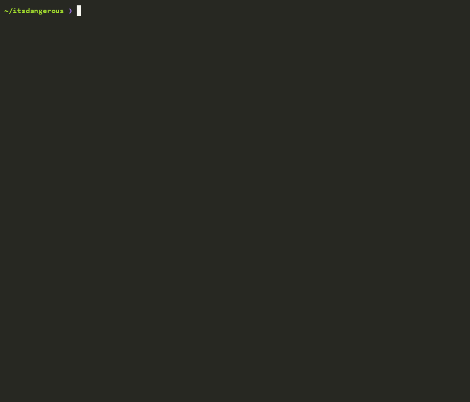

<p align="center">
  
</p>

<p align="center">
  <a href="https://pypi.org/project/codetrace-ai/"></a>
  <a href="https://pepy.tech/projects/codetrace-ai"></a>
  <a href="https://pepy.tech/projects/codetrace-ai"></a>
  <a href="https://github.com/Viraj465/CodeTrace-ai/blob/main/LICENSE"></a>
  <a href="https://github.com/Viraj465/CodeTrace-ai/stargazers"></a>
  <a href="https://github.com/Viraj465/CodeTrace-ai/issues"></a>
  <a href="https://github.com/Viraj465/CodeTrace-ai/pulls"></a>
  <a href="https://github.com/Viraj465/CodeTrace-ai/actions"></a>
  <a href="https://join.slack.com/t/codetraceaicommunity/shared_invite/zt-426wp89up-7bgYODTfYeKLE~psG5Jy8Q"></a>
  <a href="https://github.com/Viraj465/CodeTrace-ai/pulls"></a>
</p>

<h1 align="center">🧠 CodeTrace AI</h1>

<p align="center">
  <strong>The Governed Code Intelligence Layer for AI Agents — Deterministic Call Graphs, Blast Radius Verification, and Evidence-Backed Reasoning, 100% Local.</strong>
</p>

<p align="center">
  CodeTrace AI turns your codebase into a deterministic structural graph and enforces a Governed Pipeline Protocol — giving AI agents and developers verified blast radius and exact `file:line` citations. Parsing, embeddings and the graph run 100% on your machine; pair it with Ollama and nothing leaves it at all.
  <br/>
  <a href="https://codetraceai.in">Website</a> · <a href="https://pypi.org/project/codetrace-ai/">PyPI</a> · <a href="https://dev.to/viraj465/codetrace-ai-v101-ai-powered-code-intelligence-with-sha-256-delta-sync-interactive-code-graphs-257i">Blog Post</a>
</p>

<p align="center">
  
  <br/>
  <sub>Real session, shown at 2× speed: blast-radius question on <a href="https://github.com/pallets/itsdangerous">pallets/itsdangerous</a>, answered by <code>qwen3.5:4b</code> via Ollama on a 6 GB laptop GPU. Nothing left the machine.</sub>
</p>

---

## 🎥 See it in Action

[](https://youtu.be/2RbFVw-wfgE)

---

## 💡 Why CodeTrace AI?

AI coding agents break production systems because they operate on **unverified assumptions**. They edit functions without understanding downstream callers, fabricate plausible-sounding file paths, and suffer from the **self-correction blind spot** — unable to detect structural errors in their own suggestions.

CodeTrace moves AI coding from **guessing** to **governed, deterministic execution**:

- 🏛️ **Governed Pipeline Protocol.** Every structural claim is evidence-graded (`CONFIRMED`, `INFERRED`, `UNRESOLVED`) and anchored to mandatory `file:line` citations. The agent abstains when evidence is missing rather than hallucinating.
- 💥 **Runtime Blast Radius Verification.** Maps exact caller/callee relationships across 21 languages using Tree-sitter ASTs so you see every affected module, test, and consumer *before* an edit commits.
- ✍️ **Human-in-the-Loop Safe Edits.** Code changes are proposed as unified diff previews with path-traversal protection — nothing writes to disk without explicit approval.
- 🎨 **Provider-Agnostic Output Consistency.** Built-in normalizer standardizes formatting, syntax blocks, and headings across any model — from local Ollama (7B) to frontier cloud LLMs.
- 🔒 **100% Local & Air-Gapped.** All parsing, vector embeddings, and graph traversal run entirely on your hardware. With Ollama (or `--offline`), zero code leaves your machine; with a cloud LLM, only the snippets the agent retrieves are sent to your provider.

---

## 🚀 Installation

Requires **Python 3.10–3.12**

```bash
pip install codetrace-ai
```
```bash
uv pip install codetrace-ai
```

> [!NOTE]
> Python 3.14 may have compatibility issues with some dependencies. Python 3.10–3.12 is recommended for the best experience. GPU users should ensure CUDA is installed.

---

## ⚡ Quick Start

```bash
cd /path/to/your/project
codetrace init       # configure LLM + download models + index + register MCP
codetrace chat       # start the AI Architect session
```

> `codetrace init` does everything in one command: configures your LLM provider, downloads embedding models, indexes your codebase, and registers the MCP server for Cursor, Claude Code, and VS Code.

---

## ✨ Features

| Feature | Description |
|---------|-------------|
| 🔍 **Autonomous Code Research** | Ask anything in natural language — the agent searches, reads files, and traverses the call graph to answer with citations to exact lines |
| 🗺️ **Interactive Architecture Map** | `codetrace visualize` generates a self-contained interactive HTML graph of your entire code architecture |
| 📊 **Structural Call Graph** | Maps class and function definitions across 21 languages — see exactly how your application is wired |
| 🔌 **Any LLM Provider** | Six built-in providers plus a `custom` option that connects to any OpenAI- or Anthropic-compatible endpoint — just give the URL and model name |
| 💥 **Blast Radius Analysis** | Before editing production code, see every file, test, and consumer that will be impacted |
| ✍️ **Human-in-the-Loop Edits** | Proposes code changes with a rich diff preview — you approve or decline before anything is written to disk |
| ⚡ **SHA-256 Delta Sync** | Re-indexes only files that changed. Lightning fast on every subsequent run |
| 🔌 **IDE Integration (MCP)** | Connects the call graph directly into Cursor, Windsurf, or Claude Code for in-editor AI assistance |
| 📜 **Persistent Chat Sessions** | All conversations are saved. Resume any past session by ID, or export to Markdown |
| 🔒 **100% Local & Air-Gapped** | All parsing, embedding, and graph mapping happens on your machine. Zero data leaves without your consent |
| 🏛️ **Governed Pipeline Protocol** | Every answer is evidence-graded (CONFIRMED / INFERRED / UNRESOLVED) with mandatory `file:line` citations — the agent says what's missing instead of guessing |
| 🎨 **Output Normalizer** | Provider-agnostic response consistency layer: normalizes headings, bullet styles, code-fence tags, and spacing so the CLI renders uniformly regardless of model |

---

## 🏛️ Governed Pipeline Protocol

v1.0.3 ships a formal **evidence governance layer** baked into the system prompt and enforced at the agent-loop level. The agent operates under strict source-of-truth rules:

**Evidence States — every claim carries one:**

| State | Meaning |
|-------|---------|
| `CONFIRMED` | Established by a live tool call this session |
| `INFERRED` | Reasoning from confirmed evidence — always labelled "Based on the call pattern…" |
| `UNRESOLVED` | Insufficient or ambiguous evidence — the agent says so rather than guessing |

**Structural Rules:**
1. No structural fact may be asserted without a tool call that session. Framework conventions and training data are not evidence.
2. Every structural claim carries a `file:line` citation from tool output. No citation → no claim.
3. Memory (compressed summaries, prior sessions) is **context**, not evidence. A recalled citation is invalid until re-verified live.
4. If evidence is missing: the agent states exactly what's missing and what re-indexing is required — never inventing paths, symbols, or relationships.

**Investigation Protocol** — applied in the narrowest sequence the question needs:

```
search_codebase → get_symbol_relations → read_file → analyze_impact → report
```

This is not just prompt engineering — it's an architectural constraint. The output normalizer enforces consistent formatting, and the token manager adapts how much context each tier gets so the governance rules actually fit in the window.

---

## 🌍 Language Support

**21 languages.** 17 are parsed with Tree-sitter into a full symbol + call graph; 4 config/data formats are parsed into symbols for search and structure.

| Layer | Languages |
|-------|-----------|
| **Tree-sitter** (symbols + call edges) | Python · JavaScript · JSX · TypeScript · TSX · Java · C · C++ · C# · Go · Rust · PHP · Swift · Kotlin · Bash · HTML · CSS · JSON |
| **Structural** (symbols only) | YAML · TOML · SQL · Dockerfile |

---

## 🧠 Connecting Any LLM

Codetrace ships with six providers configured out of the box, plus a `custom` option for everything else.

| Provider | Notes |
|----------|-------|
| `anthropic` | Native Messages API |
| `openai` · `groq` · `gemini` · `openrouter` | OpenAI-compatible |
| `ollama` | Local, no API key, hardware-aware context sizing |
| **`custom`** | **Any OpenAI- or Anthropic-compatible endpoint** |

### Using a provider that isn't listed

Pick `custom` during `codetrace config` and answer three questions — API style, base URL, and model name:

```
1. Choose your LLM Provider: custom
2. API style [openai/anthropic]: openai
2a. API base URL: https://api.deepseek.com/v1
2b. API key (leave blank for a local or unauthenticated endpoint): ****
3. Enter model name: deepseek-chat
```

Codetrace fetches the endpoint's model list automatically when it exposes one; otherwise you just type the model name.

**Choosing the API style** — this decides the request path, so it has to match your endpoint:

| Style | Requests go to | Give the base URL as |
|-------|----------------|----------------------|
| `openai` | `{base_url}/chat/completions` | including the version path — `https://api.deepseek.com/v1` |
| `anthropic` | `{base_url}/v1/messages` | the bare host — `https://api.anthropic.com` |

**Verified examples:**

```jsonc
// DeepSeek
{ "provider": "custom", "api_style": "openai",
  "base_url": "https://api.deepseek.com/v1", "model_name": "deepseek-chat" }

// Self-hosted vLLM / LM Studio — no API key needed
{ "provider": "custom", "api_style": "openai",
  "base_url": "http://localhost:8000/v1", "model_name": "Qwen/Qwen2.5-Coder-32B" }

// An Anthropic-compatible gateway
{ "provider": "custom", "api_style": "anthropic",
  "base_url": "https://gateway.internal", "model_name": "claude-opus-5" }
```

The same shape works for Together, Fireworks, Mistral, Cerebras, DeepInfra, Nebius, corporate proxies — anything speaking either protocol. Config lives at `~/.codetrace/config.json`.

---

## 🔒 Privacy-First Architecture

Codetrace can operate **100% offline** with zero external dependencies:

1. **Local LLM:** Configure any local provider via **Ollama** (e.g., `llama3.2`, `deepseek-coder`, `qwen2.5-coder`).
2. **Local Embeddings:** Uses HuggingFace `bge-small` + `e5-small` models, downloaded once and cached.
3. **True Air-Gap:** Transfer the HuggingFace cache (`~/.cache/huggingface/hub`) via USB. Run `codetrace init --offline` to block all external calls permanently.

> [!WARNING]
> **Ollama Users — Context Window & RAM**
> The effective context window is **directly limited by your available RAM**. If the model's context exceeds available RAM, Ollama may hang or crash silently.
>
> **Recommendations:**
> - **8 GB RAM:** `qwen2.5-coder:7b` · `deepseek-r1:7b` · `phi4-mini`
> - **16 GB RAM:** `qwen2.5-coder:14b` · `deepseek-r1:14b` · `gemma3:12b` *(recommended sweet spot)*
> - **32 GB+ RAM:** `qwen2.5-coder:32b` · `deepseek-r1:32b` · `devstral:24b` *(near frontier-level locally)*
>
> If Codetrace hangs during chat while using Ollama, the most likely cause is the model running out of RAM. Switch to a smaller model with `codetrace config`.
>
> **Automatic context sizing:** CodeTrace detects your GPU's memory and picks a safe `num_ctx` automatically, then lowers it (after the current turn finishes) if it detects the model spilling to CPU — and on a hard out-of-memory it stops the response and asks before retrying at a smaller window. Override the auto-sizing anytime with `codetrace set-ctx <tokens>` (or `codetrace set-ctx 0` to return to auto).

---

## 🛠️ CLI Command Reference

| Command | Description |
|---------|-------------|
| `codetrace init [PATH]` | One-command setup: config → download models → index → register MCP |
| `codetrace chat` | Launch the interactive AI Architect chat loop |
| `codetrace chat --resume <ID>` | Resume a specific past chat session |
| `codetrace index <PATH or URL>` | Re-index a local directory, or clone + index a GitHub/GitLab URL (kept under `~/.codetrace/repos/`; `cd` there and run `codetrace chat`) |
| `codetrace mcp [PATH]` | Start the Model Context Protocol (MCP) server for external IDE/agent integration |
| `codetrace config` | View or update your LLM provider, endpoint, and API key |
| `codetrace set-ctx [TOKENS]` | (Ollama) Manually set the context window (`num_ctx`), overriding GPU auto-detection. `0` clears it back to auto |
| `codetrace set-default-ctx <TOKENS>` | Fallback context window for cloud models CodeTrace doesn't recognise |
| `codetrace set-model-limits` | Pin `--context-window` / `--max-output-tokens` for the configured cloud model |
| `codetrace register-mcp [PATH]` | Re-register the MCP server with Claude Code, Cursor and VS Code for a project |
| `codetrace visualize` | Generate an interactive HTML architecture graph |
| `codetrace history` | List all past chat sessions for the current project |
| `codetrace export <ID>` | Export a chat session to Markdown |

**Flags:**

| Flag | Applies to | Description |
|------|-----------|-------------|
| `--offline` | `init`, `chat` | Strict air-gapped mode (blocks all external requests) |
| `--fast` | `init` | Use smaller embedding models for lower RAM usage |
| `--llm <provider>` | `init` | Pre-select provider: `anthropic`, `openai`, `gemini`, `groq`, `ollama`, `openrouter`, `custom` |
| `--resume <ID>` | `chat` | Resume a specific past session |
| `--backoff <0.25–0.9>` | `set-ctx` | Fraction of the window kept each time it auto-lowers under memory pressure (`0.5` = halve). Can be set on its own: `codetrace set-ctx --backoff 0.75` |

**In-chat commands:**
- `/clear` — Start a fresh session without exiting
- `exit` / `quit` — Close the chat

---

## 🤖 Agentic Tool Suite

The AI has access to 7 specialized tools it invokes autonomously:

| Tool | What it does |
|------|-------------|
| `search_codebase` | Hybrid semantic search (BGE + E5 + RRF + FlashRank reranker) |
| `get_symbol_relations` | Graph traversal — see callers and dependencies of any symbol |
| `analyze_impact` | Blast radius — find every downstream symbol affected by a change |
| `read_file` | Read full file content from the indexed DB snapshot |
| `write_file` | Propose a code change with a diff preview for your approval |
| `inspect_index` | List all indexed files and DB coverage metadata |
| `git_diff` | Run a safe, injection-protected `git diff` |

---

## 🔌 IDE Integration (MCP)

`codetrace init` **automatically** registers the MCP server for **Claude Code**, **Cursor**, and **VS Code** in the project's own config files — `.mcp.json`, `.cursor/mcp.json`, and `.vscode/mcp.json` — so each project's server points at that project's index. Existing entries in those files are kept; a file that isn't plain JSON (for example, one with comments) is left untouched and reported so you can add the entry by hand. Re-run `codetrace register-mcp` any time. These files contain absolute paths for your machine, so you may want to keep them out of version control.

Your IDE instantly gains access to all 7 tools above for in-editor AI assistance.

### Running the MCP Server directly via CLI

You can also start the MCP server yourself for any indexed project. It speaks MCP over **stdio**, so it's meant to be launched by an IDE or agent, which then talks to it over stdin/stdout:

```bash
codetrace mcp .                         # start MCP server on current directory
codetrace mcp /path/to/project          # start MCP server on a specific project
```

**Using Windsurf?** Add it manually to your `mcp.json`. The server ships inside the installed package, so point at that — not at your project:

```json
"codetrace": {
  "command": "/path/to/your/python",
  "args": [
    "/path/to/site-packages/codetrace_mcp/server.py",
    "--project",
    "/absolute/path/to/your/project"
  ]
}
```

Find both paths with:
```bash
python -c "import sys, codetrace_mcp, pathlib; print(sys.executable); print(pathlib.Path(codetrace_mcp.__file__).parent / 'server.py')"
```

---

## 📂 File Structure

After `codetrace init`, your project will have:

```
your-project/
├── .codetrace/
│   ├── chroma/                ← vector embeddings (ChromaDB)
│   ├── graph_metadata.db      ← code call graph (SQLite + NetworkX)
│   ├── sync_metadata.db       ← SHA-256 delta sync state
│   ├── chat_history.db        ← persistent chat sessions
│   └── graph_visualization.html  ← generated by `codetrace visualize`
├── src/
└── your code files
```

*Global config is stored at `~/.codetrace/config.json`*

---

## 🆕 Changelog

### v1.0.3 — September 2026
- ✅ **NEW:** `codetrace mcp [PATH]` — start the MCP server (stdio) straight from the CLI, and `codetrace register-mcp` to (re)register it per project for Claude Code, Cursor and VS Code
- ✅ **NEW:** **Governed Pipeline Protocol** — every structural claim must carry a live `file:line` citation and is graded `CONFIRMED` / `INFERRED` / `UNRESOLVED`; memory is treated as context, never as evidence
- ✅ **NEW:** **Output Normalizer** — normalizes headings, bullet styles, code-fence language tags and spacing so answers render the same whichever provider you use
- ✅ **NEW:** The `custom` provider connects to **any** OpenAI- or Anthropic-compatible endpoint (DeepSeek, vLLM, LM Studio, gateways). API keys are optional for local endpoints
- ✅ **NEW:** Hardware-aware Ollama — native Ollama API, GPU memory detection (NVIDIA / Apple Silicon), automatic `num_ctx` sizing, and auto-lowering under memory pressure. Tune with `codetrace set-ctx [TOKENS] --backoff 0.75`
- ✅ **NEW:** `codetrace set-default-ctx` and `codetrace set-model-limits` for cloud models LiteLLM doesn't know
- ✅ **NEW:** Indexing a GitHub/GitLab URL keeps the clone under `~/.codetrace/repos/`, so re-indexing is incremental and you can `codetrace chat` against it
- ✅ **SECURITY:** `~/.codetrace/config.json` (holds your API key) is now written atomically with owner-only permissions
- ✅ **SECURITY:** `read_file` / `write_file` path checks use `is_relative_to`, so a sibling folder like `project-secret` no longer passes for `project`; writes outside the project are refused before the approval prompt
- ✅ **FIXED:** `git_diff` always returned an empty diff (the revision was passed after `--`, so git treated `HEAD` as a filename)
- ✅ **FIXED:** Blank "Architect Error:" messages — timeouts and other empty exceptions now show a readable cause
- ✅ **FIXED:** Re-indexing a file dropped inbound call edges from other files; calls no longer resolve across unrelated languages
- ✅ **FIXED:** API-key leak detector no longer flags commit SHAs and long identifiers as keys
- ✅ **FIXED:** `NameError: logger` that crashed every Ollama session at startup
- ✅ **FIXED:** MCP auto-registration pointed at the indexed project instead of the installed package; it now registers the current interpreter
- ✅ **FIXED:** Gemini 400 errors from `stream_options`; Gemini now always runs at temperature 1.0
- ✅ **IMPROVED:** Thread-safe Tree-sitter parsing, chunked ChromaDB upserts, batched FlashRank re-ranking (no more OOM on CPU-only machines), SQLite-safe chunked deletes, case-insensitive paths on Windows
- ✅ **IMPROVED:** Built-in ignore list (`node_modules`, virtualenvs, IDE folders, …) and correct handling of nested `.gitignore` files
- ✅ **TESTS:** First automated test suite (indexing regressions, MCP server, output normalizer, safety & config, token manager) running in CI

### v1.0.2 — July 2026
- ✅ **FIXED:** PyPI packaging bug — 4 missing `__init__.py` files caused `src/cli`, `src/backend`, `src/core/agents`, and `src/core/database` to be silently excluded from the wheel, making the installed package non-functional
- ✅ **FIXED:** Tree-sitter `.scm` query files were not included in the PyPI wheel, causing parser failures on a fresh install
- ✅ **NEW:** Dynamic model context window resolution via `litellm` — the token budget manager now auto-detects the correct context window for any model at runtime, eliminating the need for a hardcoded tier registry
- ✅ **NEW:** Ollama context window detection — queries the local Ollama API to get the actual loaded context size for your model
- ✅ **IMPROVED:** Token counting now uses `litellm.token_counter` with provider-specific tokenizers for accurate budgeting across all models
- ✅ **IMPROVED:** Context compression is now dynamic — automatically reduces `keep_turns` if a compressed history still exceeds the hard context limit, preventing OOM errors

### v1.0.1 — June 2026
- ✅ **NEW:** Interactive Architecture Visualizer (`codetrace visualize`) with collapsible tree, hover panels, search, and cross-folder call edges
- ✅ **NEW:** Expanded language support — C#, Swift, Kotlin, Bash, HTML, JSON, CSS, YAML, SQL, TOML, Dockerfile (21 languages total)
- ✅ **NEW:** Token Budget Manager — 3-tier context window management with auto-history compression
- ✅ **NEW:** Multi-provider Agent Loop via pure `httpx` (zero LangChain dependency)
- ✅ **NEW:** Live model listing during `codetrace config` — fetches available models from your provider's API
- ✅ **IMPROVED:** Parallel file parsing with `ThreadPoolExecutor` for significantly faster indexing
- ✅ **IMPROVED:** Path traversal protection on `read_file` and `write_file` tools

### v0.1.2 — Initial Release
- Initial public release with Hybrid Brain engine (BGE + E5 + ChromaDB + NetworkX)
- Core agentic tool suite (`search_codebase`, `analyze_impact`, `write_file`, `git_diff`)
- MCP auto-registration for Cursor and Claude Code
- SHA-256 Smart Delta Sync
- GitHub URL cloning + indexing support
- Persistent chat sessions with `history` and `export`

---

## 🤝 Contributing

We welcome contributions! See [CONTRIBUTING.md](CONTRIBUTING.md) for guidelines.

💬 **Help shape Codetrace:** [Join the discussion →](https://github.com/Viraj465/CodeTrace-ai/discussions/5#discussion-9684949)

---

## 📄 License

MIT License — Copyright (c) 2026 Viraaj Sawant. See [LICENSE](LICENSE) for details.