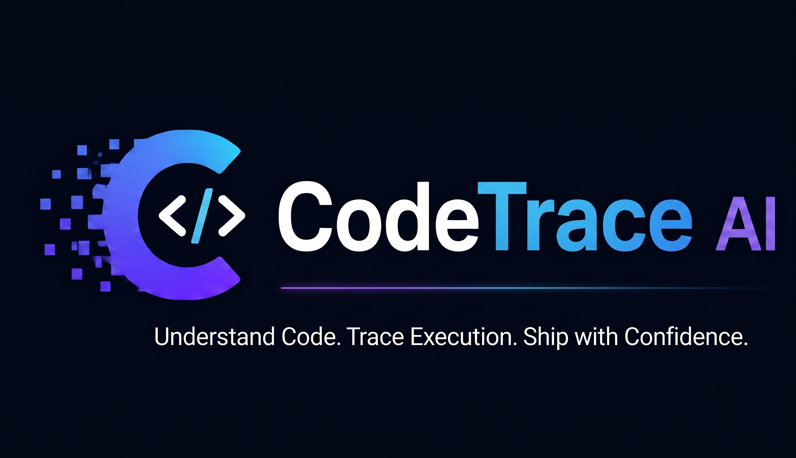

<p align="center">
  
</p>

<p align="center">
  <a href="https://pypi.org/project/codetrace-ai/"></a>
  <a href="https://pypi.org/project/codetrace-ai/"></a>
  <a href="https://github.com/Viraj465/CodeTrace-ai/blob/main/LICENSE"></a>
  <a href="https://github.com/Viraj465/CodeTrace-ai/stargazers"></a>
  <a href="https://github.com/Viraj465/CodeTrace-ai/pulls"></a>
  <a href="https://github.com/Viraj465/CodeTrace-ai/issues"></a>
  <a href="https://github.com/Viraj465/CodeTrace-ai/pulls"></a>
  <a href="https://github.com/Viraj465/CodeTrace-ai/actions"></a>
  <a href="https://join.slack.com/t/codetraceaicommunity/shared_invite/zt-426wp89up-7bgYODTfYeKLE~psG5Jy8Q"></a>
</p>

<h1 align="center">🧠 Codetrace AI</h1>
<p align="center"><strong>The Autonomous System Architect for your Terminal and IDE.</strong></p>
<p align="center">Codetrace AI is a privacy-first AI agent that builds a "Hybrid Brain" of your codebase — combining semantic vector search with structural call-graph analysis — so it understands <em>what calls what</em>, <em>who owns what</em>, and <em>what breaks if you change something</em>.</p>

---

## 🎥 See it in Action

[](https://youtu.be/2RbFVw-wfgE)

---

## 🆕 What's New in v1.0.0

### ✨ Interactive Architecture Visualizer (`codetrace visualize`)
The biggest addition yet. A completely new, interactive HTML architecture map generated directly from your code graph.

- **Folder-level dependency map** — groups all symbols by directory and renders cross-folder function call edges
- **Hover on any folder** → instantly highlights all its connections and shows a detailed breakdown panel
- **Hover on any edge** → reveals the exact function-to-function calls driving that dependency
- **Click a folder** → opens a detail sidebar showing all files, symbols, and dependency counts
- **Collapsible tree** with smooth animations — `[+]` / `[-]` indicators keep large graphs navigable
- **Search bar** — find any symbol and highlight its containing folder instantly
- **Drag, zoom, and pan** — full interactive layout control

### 🌍 Multi-Language Parser Expansion (11+ Languages)
Codetrace now parses C#, Swift, Kotlin, Bash, HTML, JSON, CSS, YAML, SQL, TOML, and Dockerfiles in addition to the original Python, JS, TS, Java, C++, Go, Rust, and PHP.

### 📄 MIT Licensed
Codetrace AI is now open-source. Contributions, bug reports, and feature requests are welcome. If you build something with or inspired by Codetrace, we'd love to hear about it — please credit the original project.

---

## ✨ Full Feature Set

Codetrace acts as a highly knowledgeable senior engineer on your project:

| Feature | Description |
|---------|-------------|
| 🔍 **Autonomous Code Research** | Ask a question, and the agent proactively searches, reads files, and traverses the graph to find the exact answer |
| 🗺️ **Interactive Architecture Map** | `codetrace visualize` generates a beautiful, self-contained interactive HTML graph of your code architecture |
| 📊 **Structural Call Graph Mapping** | Navigates class and function definitions across 11+ languages to see exactly how your application is wired |
| 💥 **Blast Radius Analysis** | Analyzes the downstream impact of a code change before you make it, preventing unintended breakages |
| ✍️ **Human-in-the-Loop Code Edits** | Proposes code changes with a rich diff preview — you approve or decline before anything is written to disk |
| ⚡ **Smart SHA-256 Delta Sync** | Re-indexes only the files that actually changed. Lightning fast on every subsequent run |
| 🔌 **IDE Context Injection (MCP)** | Connects the Hybrid Brain directly into Cursor, Windsurf, or Claude Code for in-editor AI assistance |
| 📜 **Persistent Chat Sessions** | All conversations are saved. Resume any past session by ID, or export it to Markdown |
| 🔒 **100% Local & Air-Gapped** | All parsing, embedding, and graph mapping happens on your machine. Zero data leaves without your consent |

---

## 🔒 Privacy-First Architecture

Codetrace is built with a **Privacy-First** design. It can operate 100% offline:

1. **Local LLM:** Configure any local provider via **Ollama** (e.g., `llama3.2`, `deepseek-coder`).
2. **Local Embeddings:** Uses HuggingFace `bge-small` + `e5-small` models, downloaded once and cached.
3. **True Air-Gap:** Transfer the HuggingFace cache (`~/.cache/huggingface/hub`) via USB. Run `codetrace init --offline` to block all external calls permanently.

> [!WARNING]
> **Ollama Users — Context Window & RAM Dependency**
> When using Ollama, the effective context window of your local model is **directly limited by your available system RAM**. If the model's context window is larger than what your RAM can load, Ollama may hang, respond extremely slowly, or crash silently.
>
> **Recommendations:**
> - **8 GB RAM:** `qwen2.5-coder:7b` · `deepseek-r1:7b` · `phi4-mini` *(best balance of coding + reasoning at this size)*
> - **16 GB RAM:** `qwen2.5-coder:14b` · `deepseek-r1:14b` · `gemma3:12b` · `gemma4:12b (quantized)` *(recommended sweet spot for most developers)*
> - **32 GB+ RAM:** `qwen2.5-coder:32b` · `deepseek-r1:32b` · `devstral:24b` *(near frontier-level code reasoning locally)*
>
> If Codetrace hangs during a chat session while using Ollama, the most likely cause is the model running out of RAM to process the context. Switch to a smaller model with `codetrace config`.

---

## 🚀 Installation

Requires Python 3.10+

```bash
pip install codetrace-ai
```
```bash
uv pip install codetrace-ai
```
**Note:** Python version 3.14 might have problem with installation of dependencies. Use python version 3.10-3.12 for better experience. 
**For GPU users, make sure you have CUDA installed.**
---

## ⚡ Quick Start

```bash
cd /path/to/your/project
codetrace init
codetrace chat
```

> `codetrace init` configures your LLM provider, downloads embedding models, indexes your codebase, and registers the MCP server — all in one command.

---

## 🛠️ CLI Command Reference

| Command | Description |
|---------|-------------|
| `codetrace init [PATH]` | One-command setup: config → download models → index → register MCP |
| `codetrace chat` | Launch the interactive AI Architect chat loop |
| `codetrace chat --resume <ID>` | Resume a specific past chat session |
| `codetrace index <PATH or URL>` | Re-index a local directory or clone + index a GitHub URL |
| `codetrace config` | View or update your LLM provider and API key |
| `codetrace visualize` | Generate and open an interactive HTML architecture graph |
| `codetrace history` | List all past chat sessions for the current project |
| `codetrace export <ID>` | Export a chat session to terminal or save as a Markdown file |

**Flags:**
- `--offline` — Strict air-gapped mode (blocks all telemetry and external requests)
- `--fast` — Use smaller embedding models for lower RAM usage
- `--llm <provider>` — Pre-select provider: `groq`, `openai`, `anthropic`, `gemini`, `ollama`

**In-chat commands:**
- `/clear` — Start a fresh session without exiting
- `exit` / `quit` — Close the chat

---

## 🤖 Agentic Tool Suite

The AI has access to 7 specialized tools it invokes autonomously:

| Tool | What it does |
|------|-------------|
| `search_codebase` | Hybrid semantic search (BGE + E5 + RRF + FlashRank reranker) |
| `get_symbol_relations` | Graph traversal — see callers and dependencies of any symbol |
| `analyze_impact` | Blast radius — find every downstream symbol affected by a change |
| `read_file` | Read full file content from the indexed DB snapshot |
| `write_file` | Propose a code change with a diff preview for your approval |
| `inspect_index` | List all indexed files and DB coverage metadata |
| `git_diff` | Run a safe, injection-protected `git diff` |

---

## 🔌 IDE Integration (MCP)

`codetrace init` **automatically** registers the MCP server in Cursor and Claude Code. No manual configuration needed.

Your IDE instantly gains access to all 7 tools above for in-editor assistance.

**Using Windsurf?** Add it manually to your `mcp.json`:
```json
"codetrace": {
  "command": "python",
  "args": [
    "/absolute/path/to/your/project/codetrace_mcp/server.py",
    "--project",
    "/absolute/path/to/your/project"
  ]
}
```

---

## 📂 File Structure

After `codetrace init`, your project will have:

```
your-project/
├── .codetrace/
│   ├── chroma/                ← vector embeddings (ChromaDB)
│   ├── graph_metadata.db      ← code call graph (SQLite + NetworkX)
│   ├── sync_metadata.db       ← SHA-256 delta sync state
│   ├── chat_history.db        ← persistent chat sessions
│   └── graph_visualization.html  ← generated by `codetrace visualize`
├── src/
└── your code files
```

*Global config is stored at `~/.codetrace/config.json`*

---

## 🆕 Changelog

### v1.0.0 — June 2026
- ✅ **NEW:** Interactive Architecture Visualizer (`codetrace visualize`) with collapsible tree, hover panels, search, and cross-folder call edges
- ✅ **NEW:** Expanded language support — C#, Swift, Kotlin, Bash, HTML, JSON, CSS, YAML, SQL, TOML, Dockerfile
- ✅ **NEW:** Token Budget Manager — 3-tier context window management with auto-history compression
- ✅ **NEW:** Multi-provider Agent Loop via pure `httpx` (zero LangChain dependency)
- ✅ **NEW:** Live model listing during `codetrace config` — fetches available models from your provider's API
- ✅ **IMPROVED:** Parallel file parsing with `ThreadPoolExecutor` for significantly faster indexing
- ✅ **IMPROVED:** Path traversal protection on `read_file` and `write_file` tools

### v0.1.2
- Initial public release with Hybrid Brain engine (BGE + E5 + ChromaDB + NetworkX)
- Core agentic tool suite (`search_codebase`, `analyze_impact`, `write_file`, `git_diff`)
- MCP auto-registration for Cursor and Claude Code
- SHA-256 Smart Delta Sync
- GitHub URL cloning + indexing support
- Persistent chat sessions with `history` and `export`

---

## 🤝 Contributing

We welcome contributions! See [CONTRIBUTING.md](CONTRIBUTING.md) for guidelines.

💬 **Help shape Codetrace:** [Join the discussion →](https://github.com/Viraj465/CodeTrace-ai/discussions/5#discussion-9684949)

---

## 📄 License

MIT License — Copyright (c) 2026 Viraaj Sawant. See [LICENSE](LICENSE) for details.